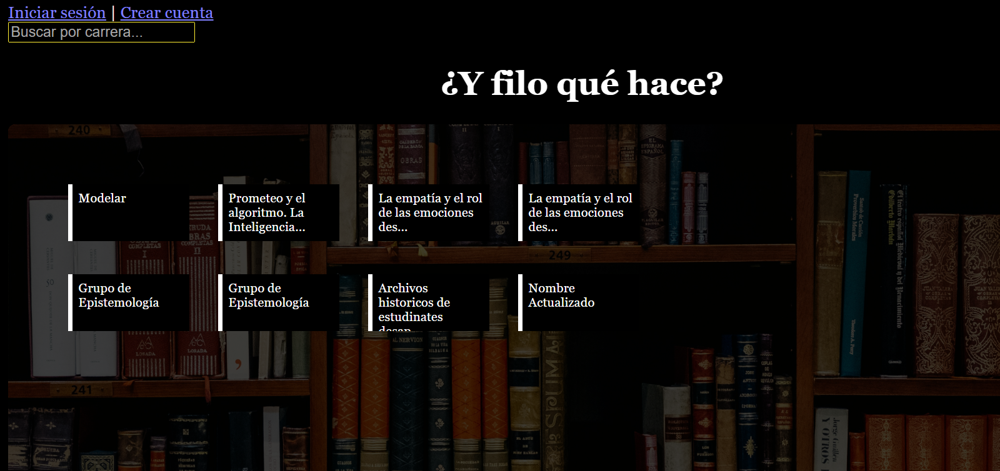
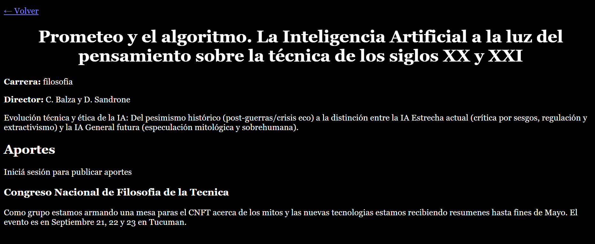

# Proyecto: ¿Y filo qué hace? 📚

**“¿Y filo qué hace?”** es una plataforma web diseñada para visibilizar la producción académica e investigativa de la **Facultad de Filosofía y Humanidades**. 

Surge con dos objetivos claros: 

1. **Compartir la producción de la universidad pública:** Trascendiendo las paredes de la facultad para que cualquier persona interesada pueda conocer, con transparencia, en qué se está trabajando. 
2. **Vinculación estudiantil:** Busca que los estudiantes conozcan las investigaciones de sus profesores para facilitar su integración a los grupos de trabajo o, en algún sentido, mapear los temas que más se tratan y detectar aquellos que aún faltan abordar.

---

### ⚙️ Lógica del Proyecto

> Cualquier persona puede observar los grupos registrados y los aportes. Sin embargo, para poder **crear un grupo**, se deberá tener un usuario registrado. 
>
> Este usuario será el **administrador del grupo y los aportes**; solamente mediante su cuenta se pueden gestionar estos contenidos.

---

## 🛠️ Tecnologías utilizadas

| Tecnología | Descripción |
| :--- | :--- |
| **Node.js & Express.js** | Servidor y manejo de rutas. |
| **MongoDB & Mongoose** | Base de datos y modelado de datos. |
| **JWT (jsonwebtoken)** | Autenticación y control de acceso. |
| **bcrypt.js** | Encriptación de contraseñas. |
| **express-rate-limit** | Protección contra ataques de fuerza bruta. |
| **express-validator / regex** | Validación de datos. |

---

## 🏗️ Estructura del proyecto (MVC)

El proyecto sigue el patrón **Modelo–Vista–Controlador (MVC)**:

```text
📂 /
├── 📂 models       # Esquemas de datos (User, Group, Aporte).
├── 📂 controllers  # Lógica de negocio y manejo de requests.
├── 📂 routes       # Definición de endpoints de la API.
├── 📂 middlewares  # Autenticación y validación de tokens.
└── 📂 config       # Configuración de base de datos.
```

La lógica del sistema se implementa directamente en los controllers, manteniendo una estructura funcional acorde al alcance del proyecto. Como mejora futura, se propone la incorporación de una capa de services para centralizar la lógica de negocio (validaciones, reglas de permisos y operaciones sobre entidades), lo que permitiría:reducir la responsabilidad de los controllers, evitar duplicación de lógica, mejorar mantenimiento del código y aumentar escalabilidad del sistema


---

## 📦 Modelo de Datos

El sistema se estructura en tres entidades principales interconectadas, diseñadas para organizar la producción académica de la facultad.

---

### 👤 Usuario (User)
Es la entidad central de autenticación. Gestiona el acceso y la vinculación con la actividad académica.

| Campo | Tipo | Descripción |
| :--- | :--- | :--- |
| `nombre` | String | Nombre del usuario (Opcional). |
| `email` | String | Identificador único y obligatorio. |
| `password` | String | Contraseña encriptada (Obligatorio). |
| `grupoId` | ObjectId | Referencia al grupo al que pertenece (Opcional). |

---

### 🧩 Grupo de Investigación (Group)
Representa la unidad de trabajo. Es el contenedor de la producción y línea académica.

| Campo | Tipo | Descripción |
| :--- | :--- | :--- |
| `nombre` | String | Nombre del grupo (Obligatorio). |
| `carrera` | String | Área académica a la que pertenece. |
| `director` | String | Responsable principal del grupo. |
| `miembros` | Array | Lista de integrantes registrados. |
| `createdBy` | ObjectId | Usuario administrador que creó el grupo. |

---

### 📄 Aporte Académico (Aporte)
Publicaciones y materiales generados dentro de un grupo.

| Campo | Tipo | Descripción |
| :--- | :--- | :--- |
| `titulo` | String | Título del trabajo o recurso (Obligatorio). |
| `descripcion` | String | Cuerpo o resumen del contenido (Obligatorio). |
| `tipo` | String | Formato (PDF, Evento, Ensayo, etc.). |
| `link` | String | Enlace a material externo o descarga. |
| `grupoId` | ObjectId | Referencia obligatoria al grupo propietario. |

---

### 🧠 Relaciones del Sistema

Para entender cómo fluye la información, el modelo sigue estas reglas de integridad:

* **1:N (Uno a Muchos):** Un **Usuario** puede crear múltiples **Grupos** y múltiples **Aportes**.
* **1:N (Contenedor):** Un **Grupo** centraliza múltiples **Aportes**.
* **Referencia:** Cada **Aporte** está anclado a un único **Grupo**.
* **Asociación:** Un **Usuario** puede o no estar vinculado formalmente a un **Grupo** específico a través de su perfil.

> [!TIP]
> Todos los modelos incluyen automáticamente los campos `createdAt` y `updatedAt` para el control de versiones y auditoría de los datos.

---

## 🔑 Endpoints principales

### 🔐 Autenticación (`/auth`)
Gestiona el acceso y la identidad de los usuarios en la plataforma.

| Método | Endpoint | Descripción | Acceso |
| :--- | :--- | :--- | :--- |
| **POST** | `/auth/register` | Registro de nuevo usuario. | Público |
| **POST** | `/auth/login` | Login y generación de JWT. | Público |
| **GET** | `/auth/profile` | Datos del usuario autenticado. | 🔒 Protegido |

---

### 🧩 Grupos (`/groups`)
Administración de las unidades de investigación.

| Método | Endpoint | Descripción | Acceso |
| :--- | :--- | :--- | :--- |
| **GET** | `/groups` | Listado de grupos (con filtros por carrera). | Público |
| **POST** | `/groups` | Creación de un nuevo grupo. | 🔒 Protegido |
| **PUT** | `/groups/:id` | Edición de grupo. | 🔑 Solo propietario |
| **DELETE** | `/groups/:id` | Eliminación de grupo. | 🔑 Solo propietario |

---

### 📄 Aportes (`/aportes`)
Gestión de la producción académica vinculada a los grupos.

| Método | Endpoint | Descripción | Acceso |
| :--- | :--- | :--- | :--- |
| **GET** | `/aportes` | Listado de aportes (filtrable por `grupoId`). | Público |
| **POST** | `/aportes` | Creación de un nuevo aporte. | 🔒 Protegido |
| **PUT** | `/aportes/:id` | Edición de aporte. | 🔑 Solo autor |
| **DELETE** | `/aportes/:id` | Eliminación de aporte. | 🔑 Solo autor |

---

> [!IMPORTANT]
> Las rutas protegidas requieren que el **JWT** sea enviado en los headers de la petición como `Authorization: Bearer <token>`.
---
## ⚙️ Instalación y Configuración

Sigue estos pasos para configurar el entorno de desarrollo y ejecutar la API localmente:

1. **Clonar el repositorio**
2. **Instalar dependencias:**  con npm install
3. **Crear archivo .env con :**
PORT
MONGO_URI
JWT_SECRET
4. **Ejecutar el servidor:** + npm run dev

---

## 🧪 Pruebas de la API

Para controlar el correcto funcionamiento del código, se utilizó **Postman**.
Puede acceder al mismo mediante:

* 🌐 **Opción 1 (Enlace Online):** [Ver documentación interactiva en Postman] ( https://elements.getpostman.com/redirect?entityId=51206499-1f53e836-a96f-46a0-89a0-a22fdeff3b27&entityType=collection )
* 📂 **Opción 2 (Archivo Local):** [Descargar archivo JSON](./y-filo-que-hace-api.json)

---

### 📝 Notas para el testeo:

> [!IMPORTANT]
> - La colección incluye ejemplos de carga de datos para cada ruta.
> - Se recomienda ejecutar primero el request de **Login** para que el Token se configure automáticamente en las rutas protegidas de Grupos y Aportes.

---
## 🖥️ Frontend

El frontend no fue desplegado en producción, pero puede ejecutarse localmente mediante **Live Server** como maqueta funcional.

Se adjuntan capturas de:
 
### Vista Principal (Biblioteca)


### Detalle del Grupo y aportes


---

## 👤 Autor

**Chiiliguay Torramorell Maria Itati.** Estudiante de **ADA** *Trabajo Práctico Integrador: ¡Tu Proyecto Back End!*


